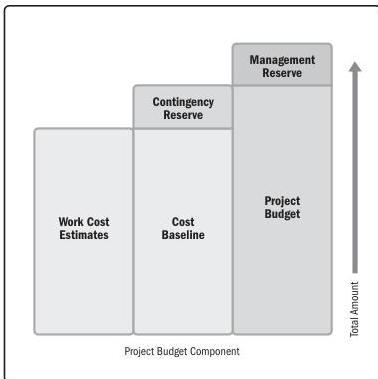

Figure 2-18. Budget Build Up

### 2.4.3 PROJECT TEAM COMPOSITION AND STRUCTURE

Planning for project team² composition begins with identifying the skill sets required to accomplish the project work. This entails evaluating not only the skills, but also the level of proficiency and years of experience in similar projects.

There are different cost structures associated with using internal project team members versus securing them from outside the organization. The benefit that outside skills bring to the project are weighed against the costs that will be incurred.

² This topic is about planning for the project team. Topics associated with project team leadership are addressed in the Team Performance Domain.

Section 2 – Project Performance Domains

63