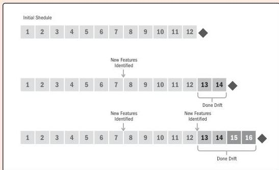

Figure 2-21 shows a scenario for developing a new smart watch. The initial schedule shows 12 months to develop the watch with the initial set of capabilities and features. As competitors launch similar products, the initial set of capabilities and features increases to stay relevant with the market. This pushes the launch date to Month 14. At 13 months, another competitor launches a product with even more capabilities. Adding these capabilities would delay the launch to Month 16. At some point, a decision will be made whether to release the product as is, even though it doesn't have the latest features, or continue to update the features prior to launch.

Figure 2-21. Scenario for Developing a Smart Watch

86

PMBOK® Guide