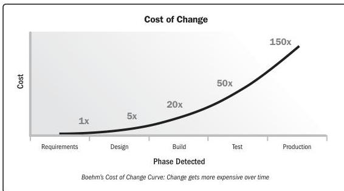

### 2.6.3.2 Cost of Change

The later a defect is found, the more expensive it is to correct. This is because design and development work have typically already occurred based on the flawed component. Also, activities are more costly to modify as the life cycle progresses since more stakeholders are impacted. This phenomenon is characterized by the cost of change curve (see Figure 2-22).

Figure 2-22. Cost of Change Curve

90

PMBOK® Guide