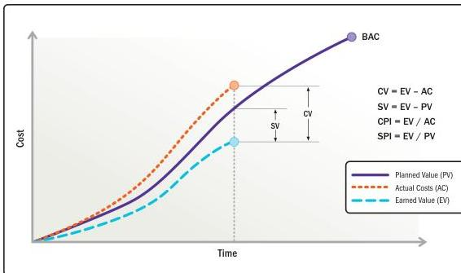

Figure 2-24. Earned Value Analysis Showing Schedule and Cost Variance

#### 2.7.2.4 Resources

Resource measurements may be a subset of cost measurements since resource variances frequently lead to cost variances. The two measures evaluate price variance and usage variance. Measures include:

- ▶ **Planned resource utilization compared to actual resource utilization.** This measurement compares the actual usage of resources to the estimated usage. A usage variance is calculated by subtracting the planned usage from the actual usage.
- ▶ **Planned resource cost compared to actual resource cost.** This measurement compares the actual cost of resources to the estimated cost. Price variance is calculated by subtracting the estimated cost from the actual cost.

Section 2 – Project Performance Domains

101