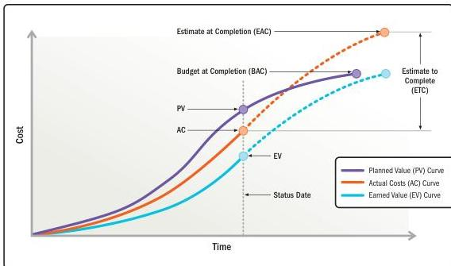

Figure 2-26. Forecast of Estimate at Completion and Estimate to Complete

- ▶ **Variance at completion (VAC).** An earned value management measure that forecasts the amount of budget deficit or surplus. It is expressed as the difference between the budget at completion (BAC) and the estimate at completion (EAC).
- ▶ **To-complete performance index (TCPI).** An earned value management measure that estimates the cost performance required to meet a specified management goal. TCPI is expressed as the ratio of the cost to finish the outstanding work to the remaining budget.
- ▶ **Regression analysis.** An analytical method where a series of input variables are examined in relation to their corresponding output results in order to develop a mathematical or statistical relationship. The relationship can be used to infer future performance.
- ▶ **Throughput analysis.** This analytical method assesses the number of items being completed in a fixed time frame. Project teams that use adaptive practices use throughput metrics such as features complete vs. features remaining, velocity, and story points to evaluate their progress and estimate likely completion dates. Using duration estimates and burn rates of stable project teams can help verify and update cost estimates.

Section 2 – Project Performance Domains

105