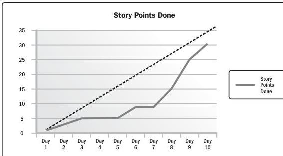

Figure 2-30. Burnup Chart

#### 2.7.4 MEASUREMENT PITFALLS

Project measures help the project team meet the project objectives. However, there are some pitfalls associated with measurement. Awareness of these pitfalls can help minimize their negative effect.

Section 2 – Project Performance Domains

111