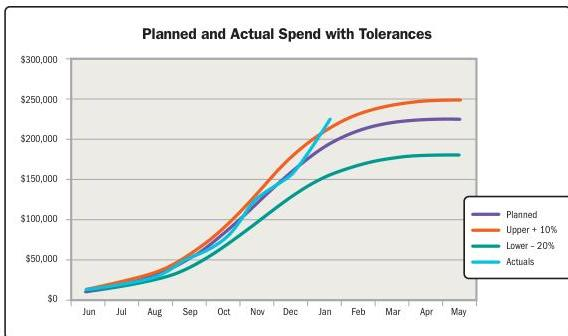

## 2.7.5 TROUBLESHOOTING PERFORMANCE

Part of measurement is having agreed to plans for measures that are outside the threshold ranges. Thresholds can be established for a variety of metrics such as schedule, budget, velocity, and other project-specific measures. The degree of variance will depend on stakeholder risk tolerances.

Figure 2-31 shows an example of a budget threshold set at +10% (orange) and -20% (green) of the predicted spend rate. The blue line is tracking the actual spend, and in January, it exceeded the +10% upper tolerance that would trigger the exception plan.

Figure 2-31. Planned and Actual Spend Rates

Ideally, project teams should not wait until a threshold has been breached before taking action. If a breach can be forecasted via a trend or new information, the project team can be proactive in addressing the expected variance.

Section 2 – Project Performance Domains

113