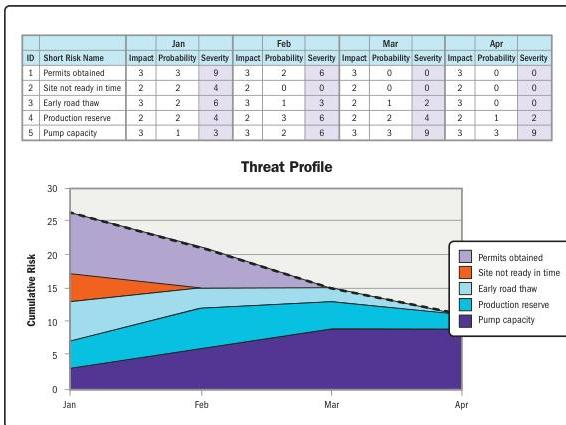

A response to a specific threat might include multiple strategies. For example, if the threat cannot be avoided, it may be mitigated to a level at which it becomes viable to transfer or to accept it.

The goal of implementing threat responses is to reduce the amount of negative risk. Risks that are accepted sometimes are reduced simply by the passage of time or because the risk event does not occur. Figure 2-33 shows how risks are tracked and reduced over time.

Figure 2-33. Risk Reduction over Time

124

PMBOK® Guide