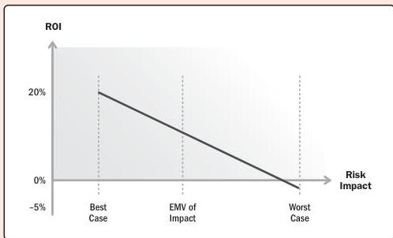

Taking an economic view of work prioritization allows the team to prioritize threat avoidance and reduction activities.

Comparing the expected monetary value (EMV) of a risk to the anticipated return on investment (ROI) of a deliverable or feature allows the project manager to have conversations with sponsors or product owners about where and when to incorporate risks responses into the planned work (see Figure 2-34).

Figure 2-34. Risk-Adjusted ROI Curve

126

PMBOK® Guide