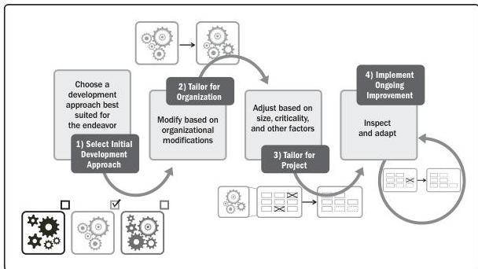

### 3.4 THE TAILORING PROCESS

As noted in Section 2.5 of *The Standard for Project Management* [1], projects exist in environments that may have an influence on them. Prior to tailoring, the project environment needs to be analyzed and understood. Tailoring typically begins by selecting a development and delivery approach, tailoring it for the organization, tailoring it for the project, and then implementing its ongoing improvement. These steps in the process are shown in Figure 3-1 and described in more detail in Sections 3.4.1 through 3.4.4 of this guide.

Figure 3-1. Details of the Steps in the Tailoring Process

Section 3 – Tailoring

137