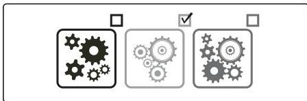

### 3.4.1 SELECT INITIAL DEVELOPMENT APPROACH

This step determines the development approach that will be used for the project. Project teams apply their knowledge of the product, delivery cadence, and awareness of the available options to select the most appropriate development approach for the situation. Selecting the initial approach is depicted in Figure 3-2.

Figure 3-2. Selecting the Initial Development Approach

A suitability filter tool helps project teams consider whether a project has characteristics that lend themselves toward a predictive, hybrid, or adaptive approach. The suitability filter is an informational tool that combines its assessment with other data and decision-making activities so that the tailored approach is appropriate for each project. By evaluating criteria based on culture, project team, and project factors, a suitability filter generates a diagnostic visual that can be helpful in discussing and deciding on the initial approach.

138

PMBOK® Guide