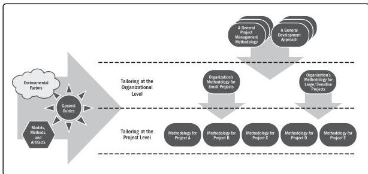

Tailoring for the organization involves adding, removing, and reconfiguring elements of the approach to make it more suitable for the individual organization. This process is shown in Figure 3-4.

Figure 3-4. Assessing the Organizational and Project Factors When Tailoring

Organizations with a project management office (PMO) or value delivery office (VDO) may play a role in reviewing and approving tailored delivery approaches.

Tailoring that only impacts the project team (e.g., when they hold internal meetings, who works where, etc.) requires less oversight than tailoring that impacts external groups (e.g., how and when other departments are engaged, etc.). Therefore, internal project tailoring might be approved by the project manager while tailoring changes that impact external groups may require approval by the PMO or VDO. The PMO or VDO can assist project teams as they tailor their approaches by providing ideas and solutions from other project teams.

140

PMBOK® Guide