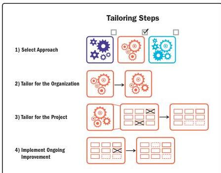

Figure 3-7. The Tailoring Process

### 3.5 TAILORING THE PERFORMANCE DOMAINS

The work associated with each performance domain can also be tailored, based on the uniqueness of the project. As shown in Figure 3-8, the principles for project management provide guidance for the behavior of project practitioners as they tailor the performance domains to meet the unique needs of the project context and the environment.

Section 3 – Tailoring

145