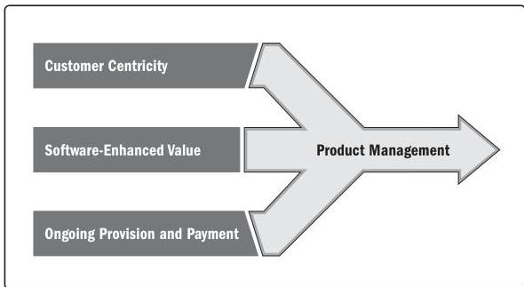

## X4.2 GLOBAL MARKET SHIFTS

Three global trends are disrupting traditional business models and transforming products and services (see Figure X4-1).

Figure X4-1. Global Business Trends Influencing the Management of Products

- **Customer centricity.** Customer centricity inverts the traditional model of organizations developing products and pushing them out to customers. Today, organizations are changing to better understand, serve, and maintain customer loyalty (see Figure X4-2). Today's technology can capture a range of customer data and requirements that organizations analyze and use for potential product enhancements, cross-selling opportunities, new product ideas, etc.

Appendix X4

219