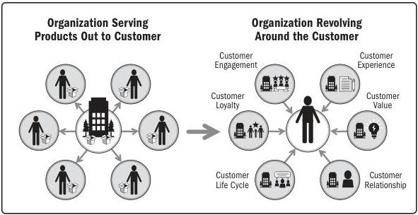

Figure X4-2. The Changing Relationship Between an Organization and Its Customers

▶ **Software-enhanced value.** Software and the capabilities it can provide have become key differentiators in a range of products and services today. Thirty years ago, software ran predominantly on dedicated computers. Ten years ago, software was embedded in control systems for vehicles and homes as a result of enhanced wireless and satellite communication systems. Now, even the most mundane appliances run software that adds new capabilities and captures usage data.

Most organizations conduct at least some portion of their transactional business electronically through websites and applications. Due to the ongoing need to upgrade and maintain these systems, these services are only truly finished with development when the product or service is retired.

▶ **Ongoing provision and payment.** Changes to established economic models are transforming many organizations. Single-transaction services are being replaced with continuous provision and payment. Examples include:

220

PMBOK® Guide