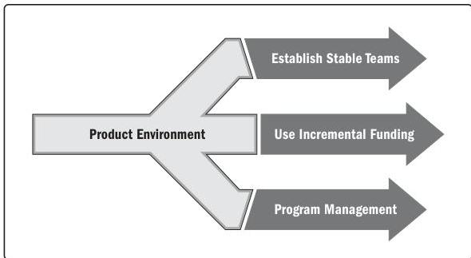

Figure X4-3. Supporting Strategies for Continuous Value Delivery

► **Establish stable teams.** Instead of disbanding the team when initial development is complete, use that team to sustain and evolve the product with the designated product owner or person within the team reflecting the customer perspective. This removes the need for knowledge transfer and reduces the risk of future enhancements being delayed due to a loss of tacit knowledge.

Long-standing teams also develop better market awareness, customer insights, and customer empathy than short-term teams. This helps with maintaining customer focus and customer loyalty and builds competitive advantage. When people know they will be responsible for maintaining and enhancing a product, they are less likely to take shortcuts to get something ready for release. As a result, quality, maintainability, and extensibility are often improved with long-serving teams rather than with teams that develop then handover products. These factors, in turn, contribute to creating value and sustaining value delivery.

222

PMBOK® Guide