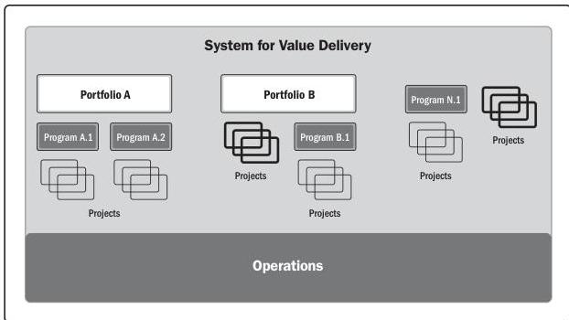

Figure 2-1. Example of a System for Value Delivery

As shown in Figure 2-2, a system for value delivery is part of an organization's internal environment that is subject to policies, procedures, methodologies, frameworks, governance structures, and so forth. That internal environment exists within the larger external environment, which includes the economy, the competitive environment, legislative constraints, etc. Section 2.4 provides more detail on internal and external environments.

Section 2 – A System for Value Delivery

9