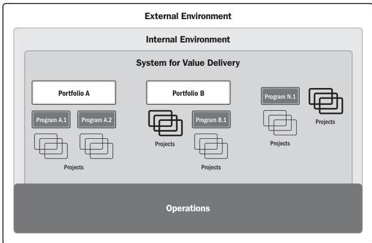

Figure 2-2. Components of a Sample System for Value Delivery

The components in a value delivery system create deliverables used to produce outcomes. An outcome is the end result or consequence of a process or a project. Focusing on outcomes, choices, and decisions emphasizes the long-range performance of the project. The outcomes create benefits, which are gains realized by the organization. Benefits, in turn, create value, which is something of worth, importance, or usefulness.

10

The Standard for Project Management