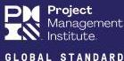

# PMBOK® Guide – Seventh Edition
## AND The Standard for Project Management

Over the past few years, emerging technology, new approaches, and rapid market changes disrupted our ways of working, driving the project management profession to evolve. Each industry, organization and project face unique challenges, and team members must adapt their approaches to successfully manage projects and deliver results.

With this in mind, *A Guide to the Project Management Body of Knowledge (PMBOK® Guide)* – Seventh Edition takes a deeper look into the fundamental concepts and constructs of the profession.

Including both *The Standard for Project Management* and the *PMBOK® Guide*, this edition presents 12 principles of project management and eight project performance domains that are critical for effectively delivering project outcomes.

This edition of the *PMBOK® Guide*:

- Reflects the full range of development approaches (predictive, traditional, adaptive, agile, hybrid, etc.);
- Devotes an entire section to tailoring development approaches and processes;
- Expands the list of tools and techniques in a new section, “Models, Methods, and Artifacts”;
- Focuses on project outcomes, in addition to deliverables; and
- Integrates with PMIstandards+™, giving users access to content that helps them apply the *PMBOK® Guide* on the job.

The result is a modern guide that better enables project team members to be proactive, innovative, and nimble in delivering project outcomes.

Project Management Institute
Global Headquarters
14 Campus Boulevard
Newtown Square, PA 19073 USA
Tel: +1 610 356 4600
PMI.org

ISBN: 978-1-62825-664-2

U.S. $99.00

9 781628 256642