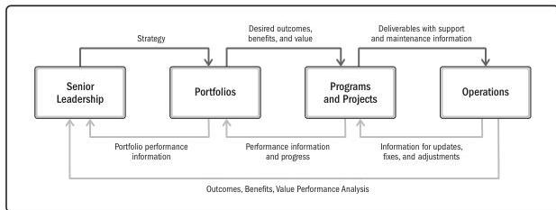

## 2.1.2 INFORMATION FLOW

A value delivery system works most effectively when information and feedback are shared consistently among all components, keeping the system aligned with strategy and attuned to the environment.

Figure 2-3 shows a model of the flow of information where black arrows represent information from senior leadership to portfolios, portfolios to programs and projects, and then to operations. Senior leadership shares strategic information with portfolios. Portfolios share the desired outcomes, benefits, and value with programs and projects. Deliverables from programs and projects are passed on to operations along with information on support and maintenance for the deliverables.

The light gray arrows in Figure 2-3 represent the reverse flow of information. Information from operations to programs and projects suggests adjustments, fixes, and updates to deliverables. Programs and projects provide performance information and progress on achieving the desired outcomes, benefits, and value to portfolios. Portfolios provide evaluations on portfolio performance with senior leadership. Additionally, operations provide information on how well the organization's strategy is advancing.

Figure 2-3. Example of Information Flow

Section 2 – A System for Value Delivery

11