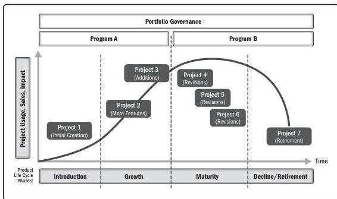

A product is an artifact that is produced, is quantifiable, and can be either an end item itself or a component item. Product management involves the integration of people, data, processes, and business systems to create, maintain, and develop a product or service throughout its life cycle. The product life cycle is a series of phases that represents the evolution of a product, from introduction through growth, maturity, and to retirement.

Product management may initiate programs or projects at any point in the product life cycle to create or enhance specific components, functions, or capabilities (see Figure 2-4). The initial product may begin as a deliverable of a program or project. Throughout its life cycle, a new program or project may add or improve specific components, attributes, or capabilities that create additional value for customers and the sponsoring organization. In some instances, a program can encompass the full life cycle of a product or service to manage the benefits and create value for the organization more directly.

Figure 2-4. Sample Product Life Cycle

Section 2 – A System for Value Delivery

19