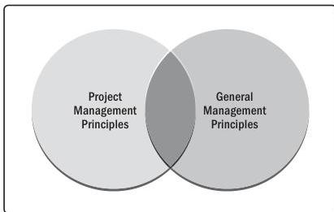

Because the principles of project management provide guidance, the degree of application and the way in which they are applied are influenced by the context of the organization, project, deliverables, project team, stakeholders, and other factors. The principles are internally consistent, meaning that no principle contradicts any other principle. However, in practice there may be times when the principles can overlap. For example, guidance for navigating complexity can present information that is useful in recognizing, evaluating, and responding to system interactions or optimizing risk responses.

Principles of project management can also have areas of overlap with general management principles. For example, both projects and business in general focus on delivering value. The methods may be somewhat different in projects as opposed to operations, but the underlying principle associated with focusing on value can apply to both. Figure 3-1 demonstrates this overlap.

Figure 3-1. Overlap of Project Management and General Management Principles

22

The Standard for Project Management