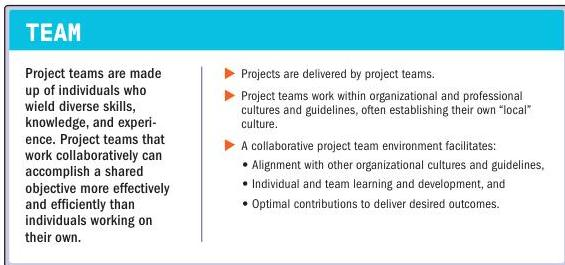

## 3.2 CREATE A COLLABORATIVE PROJECT TEAM ENVIRONMENT

Figure 3-3. Create a Collaborative Project Team Environment

Creating a collaborative project team environment involves multiple contributing factors, such as team agreements, structures, and processes. These factors support a culture that enables individuals to work together and provide synergistic effects from interactions.

28

The Standard for Project Management