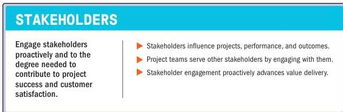

### 3.3 EFFECTIVELY ENGAGE WITH STAKEHOLDERS

Figure 3-4. Effectively Engage with Stakeholders

Stakeholders can be individuals, groups, or organizations that may affect, be affected by, or perceive themselves to be affected by a decision, activity, or outcome of a portfolio, program, or project. Stakeholders also directly or indirectly influence a project, its performance, or outcome in either a positive or negative way.

Section 3 – Project Management Principles

31