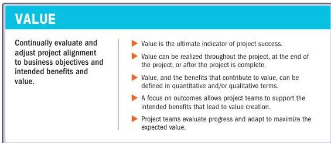

### 3.4 FOCUS ON VALUE

Figure 3-5. Focus on Value

Value, including outcomes from the perspective of the customer or end user, is the ultimate success indicator and driver of projects. Value focuses on the outcome of the deliverables. The value of a project may be expressed as a financial contribution to the sponsoring or receiving organization. Value may be a measure of public good achieved, for example, social benefit or the customer's perceived benefit from the project result. When the project is a component of a program, the project's contribution to program outcomes can represent value.

Many projects, though not all, are initiated based on a business case. Projects may be initiated due to any identified need to deliver or modify a process, product, or service, such as contracts, statements of work, or other documents. In all cases, the project intent is to provide the desired outcome that addresses the need with a valued solution. A business case can contain information about strategic alignment, assessment of risk exposure, economic feasibility study, return on investments, expected key performance measures, evaluations, and alternative approaches. The business case may state the intended value contribution of the project outcome in qualitative or quantitative terms, or both. A business case contains at least these supporting and interrelated elements:

34

The Standard for Project Management