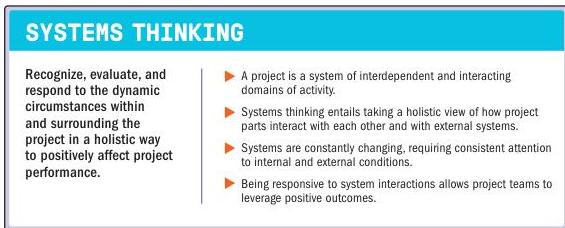

### 3.5 RECOGNIZE, EVALUATE, AND RESPOND TO SYSTEM INTERACTIONS

Figure 3-6. Recognize, Evaluate, and Respond to System Interactions

A *system* is a set of interacting and interdependent components that function as a unified whole. Taking a holistic view, a project is a multifaceted entity that exists in dynamic circumstances, exhibiting the characteristics of a system. Project teams should acknowledge this holistic view of a project, seeing the project as a system with its own working parts.

A project works within other larger systems, and a project deliverable may become part of a larger system to realize benefits. For example, projects may be part of a program which, in turn, may also be part of a portfolio. These interconnected structures are known as a *system of systems*. Project teams balance inside/out and outside/in perspectives to support alignment across the system of systems.

The project may also have subsystems that are required to integrate effectively to deliver the intended outcome. For example, when individual project teams develop separate components of a deliverable, all components should integrate effectively. This requires project teams to interact and align subsystem work on a regular basis.

Section 3 – Project Management Principles

37