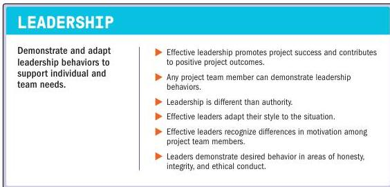

### 3.6 DEMONSTRATE LEADERSHIP BEHAVIORS

Figure 3-7. Demonstrate Leadership Behaviors

Projects create a unique need for effective leadership. Unlike general business operations, where roles and responsibilities are often established and consistent, projects often involve multiple organizations, departments, functions, or vendors that do not interact on a regular basis. Moreover, projects may carry higher stakes and expectations than regular operational functions. As a result, a broader array of managers, executives, senior contributors, and other stakeholders attempt to influence a project. This often creates higher degrees of confusion and conflict. Consequently, higher-performing projects demonstrate effective leadership behaviors more frequently, and from more people than most projects.

A project environment that prioritizes vision, creativity, motivation, enthusiasm, encouragement, and empathy can support better outcomes. These traits are often associated with leadership. Leadership comprises the attitude, talent, character, and behaviors to influence individuals within and outside the project team toward the desired outcomes.

40

The Standard for Project Management