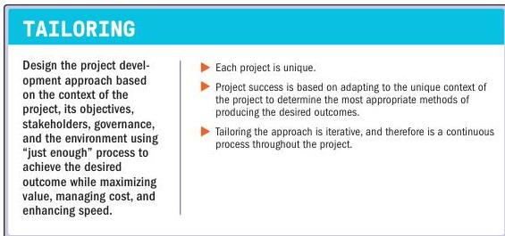

### 3.7 TAILOR BASED ON CONTEXT

Figure 3-8. Tailor Based on Context

Adapting to the unique objectives, stakeholders, and complexity of the environment contributes to project success. Tailoring is the deliberate adaptation of approach, governance, and processes to make them more suitable for the given environment and the work at hand. Project teams tailor the appropriate framework that will enable the flexibility to consistently produce positive outcomes within the context of the life cycle of the project. The business environment, team size, degree of uncertainty, and complexity of the project all factor into how project systems are tailored. Project systems can be tailored with a holistic perspective, including the consideration of interrelated complexities. Tailoring aims to maximize value, manage constraints, and improve performance by using “just enough” processes, methods, templates, and artifacts to achieve the desired outcome from the project.

44

The Standard for Project Management