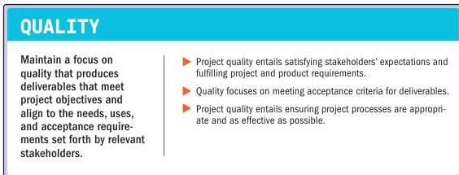

### 3.8 BUILD QUALITY INTO PROCESSES AND DELIVERABLES

Figure 3-9. Build Quality into Processes and Deliverables

Quality is the degree to which a set of inherent characteristics of a product, service, or result fulfills the requirements. Quality includes the ability to satisfy the customer's stated or implied needs. The product, service, or result of a project (referred to here as deliverables) is measured for the quality of both the conformance to acceptance criteria and fitness for use.

Section 3 – Project Management Principles

47