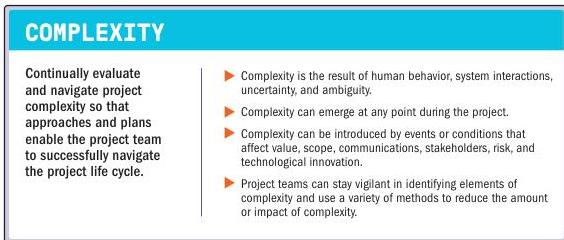

### 3.9 NAVIGATE COMPLEXITY

Figure 3-10. Navigate Complexity

A project is a system of elements that interact with each other. Complexity is a characteristic of a project or its environment that is difficult to manage due to human behavior, system behavior, and ambiguity. The nature and number of the interactions determine the degree of complexity in a project. Complexity emerges from project elements, interactions between project elements, and interactions with other systems and the project environment. Though complexity cannot be controlled, project teams can modify their activities to address impacts that occur as a result of complexity.

Project teams often cannot foresee complexity emerging because it is the result of many interactions such as risks, dependencies, events, or relationships. Alternatively, a few causes may converge to produce a single complex effect, which makes isolating a specific cause of complexity difficult.

Project complexity occurs as the result of individual elements within the project and project system as a whole. For example, complexity within a project may be amplified with a greater number or diversity of stakeholders, such as regulatory agencies, international financial institutions, multiple vendors, numerous specialty subcontractors, or local communities. These stakeholders can have a significant impact on the complexity of a project, both individually and collectively.

50

The Standard for Project Management