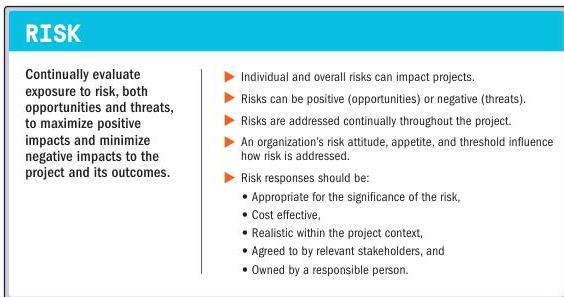

### 3.10 OPTIMIZE RISK RESPONSES

Figure 3-11. Optimize Risk Responses

A *risk* is an uncertain event or condition that, if it occurs, can have a positive or negative effect on one or more objectives. Identified risks may or may not materialize in a project. Project teams endeavor to identify and evaluate known and emergent risks, both internal and external to the project, throughout the life cycle.

Project teams seek to maximize positive risks (opportunities) and decrease exposure to negative risks (threats). Threats may result in issues such as delay, cost overrun, technical failure, performance shortfall, or loss of reputation. Opportunities can lead to benefits such as reduced time and cost, improved performance, increased market share, or enhanced reputation.

Section 3 – Project Management Principles

53