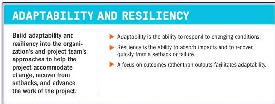

### 3.11 EMBRACE ADAPTABILITY AND RESILIENCY

Figure 3-12. Embrace Adaptability and Resiliency

Most projects encounter challenges or obstacles at some stage. The combined attributes of adaptability and resiliency in the project team's approach to a project help the project accommodate impacts and thrive. Adaptability refers to the ability to respond to changing conditions. Resiliency consists of two complementary traits: the ability to absorb impacts and the ability to recover quickly from a setback or failure. Both adaptability and resiliency are helpful characteristics for anyone working on projects.

Section 3 – Project Management Principles

55