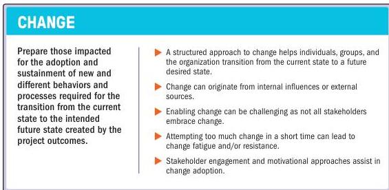

### 3.12 ENABLE CHANGE TO ACHIEVE THE ENVISIONED FUTURE STATE

Figure 3-13. Enable Change to Achieve the Envisioned Future State

Remaining relevant in today's business environment is a fundamental challenge for all organizations. Relevance entails being responsive to stakeholder needs and desires. This requires continually evaluating offerings for the benefit of stakeholders, rapidly responding to changes, and acting as agents for change. Project managers are uniquely poised to keep an organization prepared for changes. Projects, by their very definition, create something new: they are agents of change.

Change management, or enablement, is a comprehensive, cyclic, and structured approach for transitioning individuals, groups, and organizations from a current state to a future state in which they realize desired benefits. It is different from project change control, which is a process whereby modifications to documents, deliverables, or baselines associated with the project are identified and documented, and then are approved or rejected.

58

The Standard for Project Management