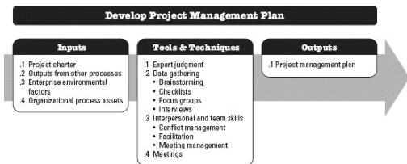
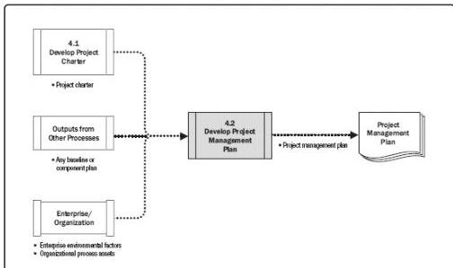

data flow diagram for the process.

Figure 4-4. Develop Project Management Plan: Inputs, Tools & Techniques, and Outputs

Figure 4-5. Develop Project Management Plan: Data Flow Diagram

The project management plan defines how the project is executed, monitored and controlled, and closed. The project management plan's content varies depending on the application area and complexity of the project.

The project management plan may be either summary level or detailed. Each component plan is described to the extent required by the specific project. The project management plan should be robust enough to respond to an ever-changing project environment. This agility may result in more accurate information as the project progresses.

The project management plan should be baselined; that is, it is necessary to define at least the project references for scope, time, and cost, so that the project execution can be measured and compared to those references and performance can be managed. Before the

105