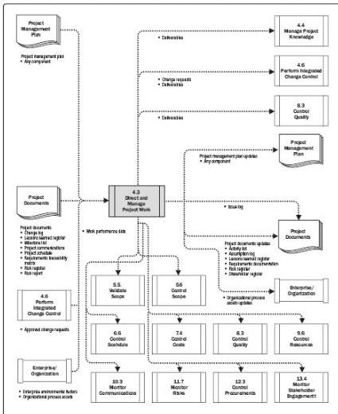

Figure 4-7. Direct and Manage Project Work: Data Flow Diagram

Direct and Manage Project Work involves executing the planned project activities to complete project deliverables and accomplish established objectives. Available resources are allocated, their efficient use is managed, and changes in project plans stemming from analyzing work performance data and information are carried out. The Direct and Manage Project Work process is directly affected by the project application area. Deliverables are produced as outputs from processes performed to accomplish the project work as planned and scheduled in the project management plan.

The project manager, along with the project management team, directs the performance of the planned project activities and manages the various technical and organizational interfaces that exist in the project. Direct and Manage Project Work also requires review of the impact of all project changes and the implementation of approved changes: corrective action, preventive action, and/or defect repair.

During project execution, the work performance data is collected and communicated to

114