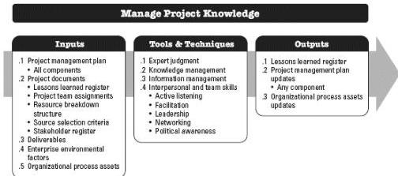

#### 4.3.3.7 ORGANIZATIONAL PROCESS ASSETS UPDATES

Any organizational process asset can be updated as a result of this process.

### 4.4 MANAGE PROJECT KNOWLEDGE

Manage Project Knowledge is the process of using existing knowledge and creating new knowledge to achieve the project's objectives and contribute to organizational learning. The key benefits of this process are that prior organizational knowledge is leveraged to produce or improve the project outcomes, and knowledge created by the project is available to support organizational operations and future projects or phases. This process is performed throughout the project. The inputs, tools and techniques, and outputs of the process are depicted in Figure 4-8. Figure 4-9 depicts the data flow diagram for the process.

Figure 4-8. Manage Project Knowledge: Inputs, Tools & Techniques, and Outputs

120