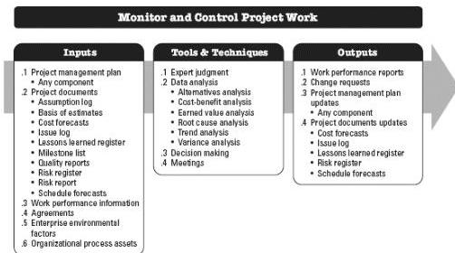

Any organizational process asset can be updated as a result of this process.

## 4.5 MONITOR AND CONTROL PROJECT WORK

Monitor and Control Project Work is the process of tracking, reviewing, and reporting the overall progress to meet the performance objectives defined in the project management plan. The key benefits of this process are that it allows stakeholders to understand the current state of the project, to recognize the actions taken to address any performance issues, and to have visibility into the future project status with cost and schedule forecasts. This process is performed throughout the project. The inputs, tools and techniques, and outputs of the process are depicted in Figure 4-10. Figure 4-11 depicts the data flow diagram for the process.

Figure 4-10. Monitor and Control Project Work: Inputs, Tools & Techniques, and Outputs

127