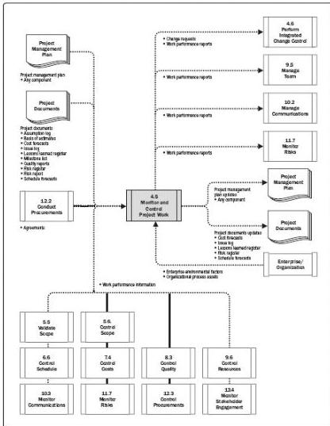

Figure 4-11. Monitor and Control Project Work: Data Flow Diagram

Monitoring is an aspect of project management performed throughout the project. Monitoring includes collecting, measuring, and assessing measurements and trends to effect process improvements. Continuous monitoring gives the project management team insight into the health of the project and identifies any areas that may require special attention. Control includes determining corrective or preventive actions or replanning and following up on action plans to determine whether the actions taken resolved the performance issue. The Monitor and Control Project Work process is concerned with:

- ◆ Comparing actual project performance against the project management plan;
- ◆ Assessing performance periodically to determine whether any corrective or preventive actions are indicated, and then recommending those actions as necessary;
- ◆ Checking the status of individual project risks;

128