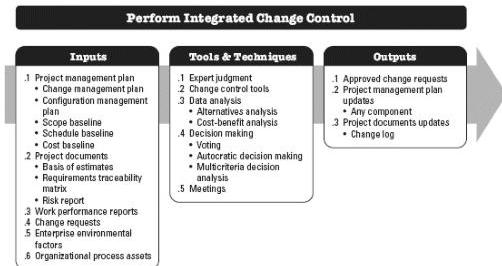

throughout the project. The inputs, tools and techniques, and outputs of the process are depicted in Figure 4-12. Figure 4-13 depicts the data flow diagram for the process.

Figure 4-12. Perform Integrated Change Control: Inputs, Tools & Techniques, and Outputs

135