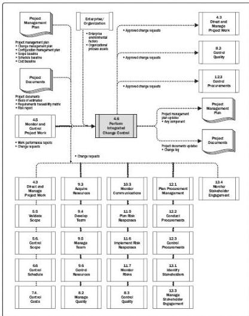

Figure 4-13. Perform Integrated Change Control: Data Flow Diagram

The Perform Integrated Change Control process is conducted from project start through completion and is the ultimate responsibility of the project manager. Change requests can impact the project scope and the product scope, as well as any project management plan component or any project document. Changes may be requested by any stakeholder involved with the project and may occur at any time throughout the project life cycle. The applied level of change control is dependent upon the application area, complexity of the specific project, contract requirements, and the context and environment in which the project is performed.

Before the baselines are established, changes are not required to be formally controlled by the Perform Integrated Change Control process. Once the project is baselined, change requests go through this process. As a general rule, each project's configuration management plan should define which project artifacts need to be placed under configuration control. Any change in a configuration element should be formally controlled

136