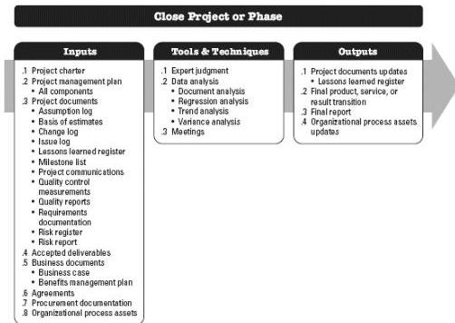

Past performance is not changed. This protects the integrity of the baselines and the historical data of past performance.

#### 4.6.3.3 PROJECT DOCUMENTS UPDATES

Any formally controlled project document may be changed as a result of this process. A project document that is normally updated as a result of this process is the change log. The change log is used to document changes that occur during a project.

### 4.7 CLOSE PROJECT OR PHASE

Close Project or Phase is the process of finalizing all activities for the project, phase, or contract. The key benefits of this process are the project or phase information is archived, the planned work is completed, and organizational team resources are released to pursue new endeavors. This process is performed once or at predefined points in the project. The inputs, tools and techniques, and outputs of the process are depicted in Figure 4-14. Figure 4-15 depicts the data flow diagram for the process.

Figure 4-14. Close Project or Phase: Inputs, Tools & Techniques, and Outputs

142