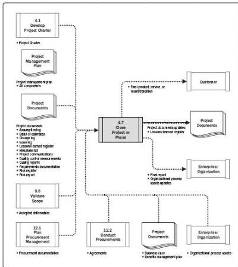

Figure 4-15. Close Project or Phase: Data Flow Diagram

When closing the project, the project manager reviews the project management plan to ensure that all project work is completed and that the project has met its objectives. The activities necessary for the administrative closure of the project or phase include but are not limited to:

- ◆ Actions and activities necessary to satisfy completion or exit criteria for the phase or project such as:
  - ■ Making certain that all documents and deliverables are up-to-date and that all issues are resolved;
  - ■ Confirming the delivery and formal acceptance of deliverables by the customer;
  - ■ Ensuring that all costs are charged to the project;
  - ■ Closing project accounts;
  - ■ Reassigning personnel;
  - ■ Dealing with excess project material;

143