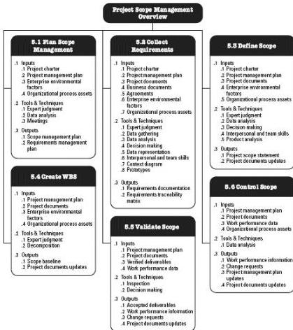

Figure 5-1. Project Scope Management Overview

## KEY CONCEPTS FOR PROJECT SCOPE MANAGEMENT

In the project context, the term “scope” can refer to:

- ◆ Product scope. The features and functions that characterize a product, service, or result.
- ◆ Project scope. The work performed to deliver a product, service, or result with the specified features and functions. The term “project scope” is sometimes viewed as including product scope.

Project life cycles can range along a continuum from predictive approaches at one end to adaptive or agile approaches at the other. In a predictive life cycle, the project deliverables are defined at the beginning of the project and any changes to the scope are progressively managed. In an adaptive or agile life cycle, the deliverables are developed over multiple iterations where a detailed scope is defined and approved for each iteration when it begins.

Projects with adaptive life cycles are intended to respond to high levels of change and require ongoing stakeholder engagement. The overall scope of an adaptive project will be

151