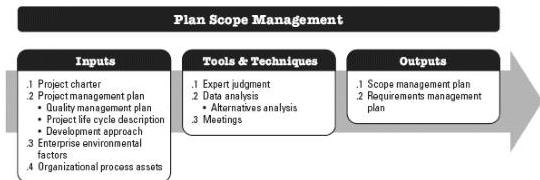

◆ Stability of requirements. Are there areas of the project with unstable requirements? Do unstable requirements necessitate the use of lean, agile, or other adaptive techniques until they are stable and well defined?
◆ Governance. Does the organization have formal or informal audit and governance policies, procedures, and guidelines?

# CONSIDERATIONS FOR AGILE/ADAPTIVE ENVIRONMENTS

In projects with evolving requirements, high risk, or significant uncertainty, the scope is often not understood at the beginning of the project or it evolves during the project. Agile methods deliberately spend less time trying to define and agree on scope in the early stage of the project and spend more time establishing the process for its ongoing discovery and refinement. Many environments with emerging requirements find that there is often a gap between the real business requirements and the business requirements that were originally stated. Therefore, agile methods purposefully build and review prototypes and release versions in order to refine the requirements. As a result, scope is defined and redefined throughout the project. In agile approaches, the requirements constitute the backlog.

# 5.1 PLAN SCOPE MANAGEMENT

Plan Scope Management is the process of creating a scope management plan that documents how the project and product scope will be defined, validated, and controlled. The key benefit of this process is that it provides guidance and direction on how scope will be managed throughout the project. This process is performed once or at predefined points in the project. The inputs, tools and techniques, and outputs of this process are depicted in Figure 5-2. Figure 5-3 depicts the data flow diagram of the process.

Figure 5-2. Plan Scope Management: Inputs, Tools & Techniques, and Outputs

154