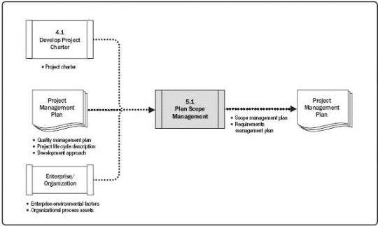

Figure 5-3. Plan Scope Management: Data Flow Diagram

The scope management plan is a component of the project or program management plan that describes how the scope will be defined, developed, monitored, controlled, and validated. The development of the scope management plan and the detailing of the project scope begin with the analysis of information contained in the project charter (Section 4.1.3.1), the latest approved subsidiary plans of the project management plan (Section 4.2.3.1), historical information contained in the organizational process assets (Section 2.3), and any other relevant enterprise environmental factors (Section 2.2).

### 5.1.1 PLAN SCOPE MANAGEMENT: INPUTS

#### 5.1.1.1 PROJECT CHARTER

Described in Section 4.1.3.1. The project charter documents the project purpose, high-level project description, assumptions, constraints, and high-level requirements that the project is intended to satisfy.

#### 5.1.1.2 PROJECT MANAGEMENT PLAN

Described in Section 4.2.3.1. Project management plan components include but are not limited to:

- Quality management plan. Described in Section 8.1.3.1. The way the project and product scope will be managed can be influenced by how the organization's quality policy, methodologies, and standards are implemented

155