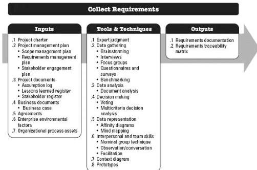

## 5.2 COLLECT REQUIREMENTS

Collect Requirements is the process of determining, documenting, and managing stakeholder needs and requirements to meet objectives. The key benefit of this process is that it provides the basis for defining the product scope and project scope. This process is performed once or at predefined points in the project. The inputs, tools and techniques, and outputs of this process are depicted in Figure 5-4. Figure 5-5 depicts the data flow diagram of the process.

Figure 5-4. Collect Requirements: Inputs, Tools & Techniques, and Outputs

158