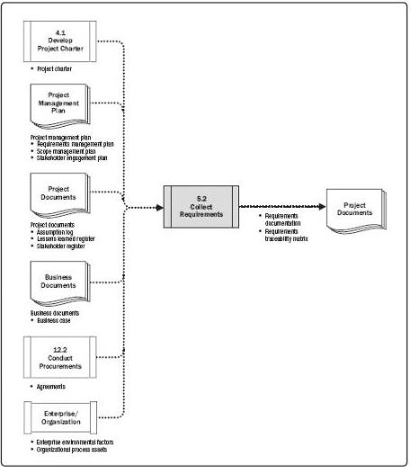

Figure 5-5. Collect Requirements: Data Flow Diagram

The *PMBOK*® *Guide* does not specifically address product requirements since those are industry specific. Note that *Business Analysis for Practitioners: A Practice Guide* [7] provides more in-depth information about product requirements. The project’s success is directly influenced by active stakeholder involvement in the discovery and decomposition of needs into project and product requirements and by the care taken in determining, documenting, and managing the requirements of the product, service, or result of the project. Requirements include conditions or capabilities that are required to be present in a product, service, or result to satisfy an agreement or other formally imposed specification. Requirements include the quantified and documented needs and expectations of the sponsor, customer, and other stakeholders. These requirements need to be elicited, analyzed, and recorded in enough detail to be included in the scope baseline and to be measured once project execution begins. Requirements become the foundation of the WBS. Cost, schedule, quality planning, and procurement are all based on these requirements.

159