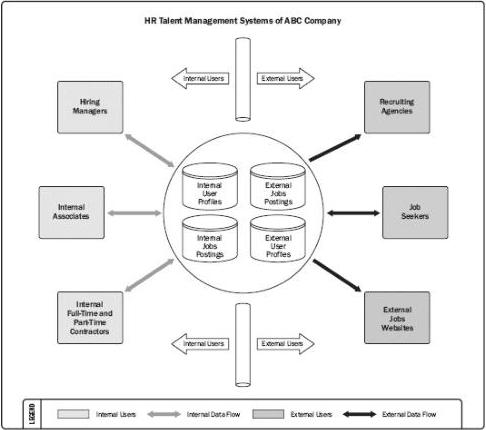

Figure 5-6. Context Diagram

## 5.2.2.8 PROTOTYPES

Prototyping is a method of obtaining early feedback on requirements by providing a model of the expected product before actually building it. Examples of prototypes are small-scale products, computer generated 2D and 3D models, mock-ups, or simulations. Prototypes allow stakeholders to experiment with a model of the final product rather than being limited to discussing abstract representations of their requirements. Prototypes support the concept of progressive elaboration in iterative cycles of mock-up creation, user experimentation, feedback generation, and prototype revision. When enough feedback cycles have been performed, the requirements obtained from the prototype are sufficiently complete to move to a design or build phase.

Storyboarding is a prototyping technique showing sequence or navigation through a series of images or illustrations. Storyboards are used on a variety of projects in a variety of industries, such as film, advertising, instructional design, and on agile and other software development projects. In software development, storyboards use mock-ups to show navigation paths through web pages, screens, or other user interfaces.

166