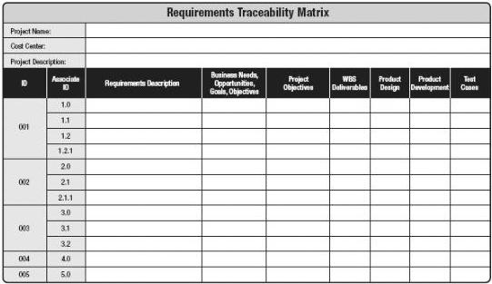
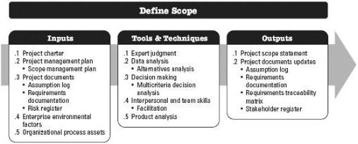

Figure 5-7. Example of a Requirements Traceability Matrix

## 5.3 DEFINE SCOPE

Define Scope is the process of developing a detailed description of the project and product. The key benefit of this process is that it describes the product, service, or result boundaries and acceptance criteria. The inputs, tools and techniques, and outputs of this process are depicted in Figure 5-8. Figure 5-9 depicts the data flow diagram of the process.

Figure 5-8. Define Scope: Inputs, Tools & Techniques, and Outputs

169