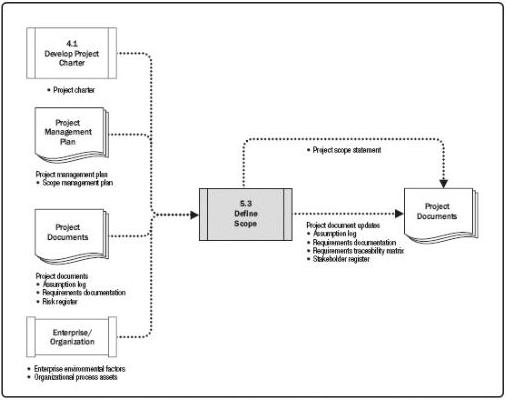

Figure 5-9. Define Scope: Data Flow Diagram

Since all the requirements identified in Collect Requirements may not be included in the project, the Define Scope process selects the final project requirements from the requirements documentation developed during the Collect Requirements process. It then develops a detailed description of the project and product, service, or result.

The preparation of a detailed project scope statement builds upon the major deliverables, assumptions, and constraints that are documented during project initiation. During project planning, the project scope is defined and described with greater specificity as more information about the project is known. Existing risks, assumptions, and constraints are analyzed for completeness and added or updated as necessary. The Define Scope process can be highly iterative. In iterative life cycle projects, a high-level vision will be developed for the overall project, but the detailed scope is determined one iteration at a time, and the detailed planning for the next iteration is carried out as work progresses on the current project scope and deliverables.

## 5.3.1 DEFINE SCOPE: INPUTS

### 5.3.1.1 PROJECT CHARTER

Described in Section 4.1.3.1. The project charter provides the high-level project

170